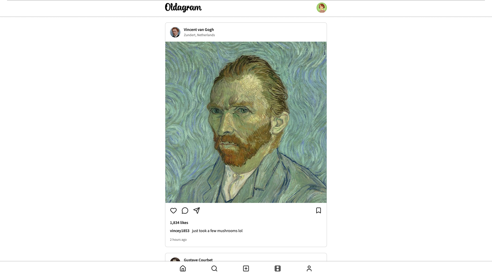

# 📷 Oldagram

<!--  -->

<!--  -->

✨ [CHECK THE FEED](https://oldagram-neon.vercel.app/)

A simple Instagram clone created to practice fundamental CSS and semantic HTML.

Initially followed provided Figma guide but decided to update the UI to something a little more modern.