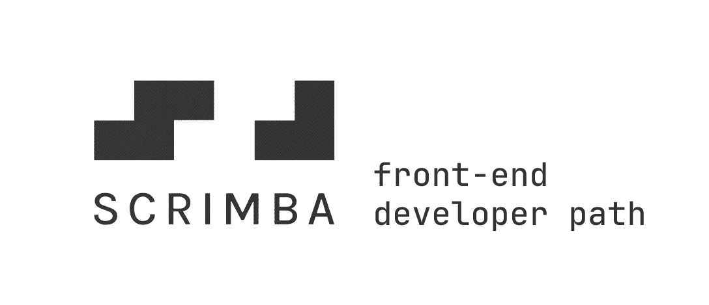

A collection of projects completed whilst working through the [Scrimba](https://scrimba.com) front-end developer path.

---

### Module 2
#### 🏠 **Hometown Homepage**
A simple website using basic CSS and HTML skills shown in the first two modules.

[Code](./01-hometown-homepage) | [Demo](https://hometown-homepage-alpha.vercel.app/)

---

### Module 3
#### 🧮 **Counter App**
A counter app using CSS, HTML and basic javascript.

[Code](./02-counter-app) | [Demo](#)